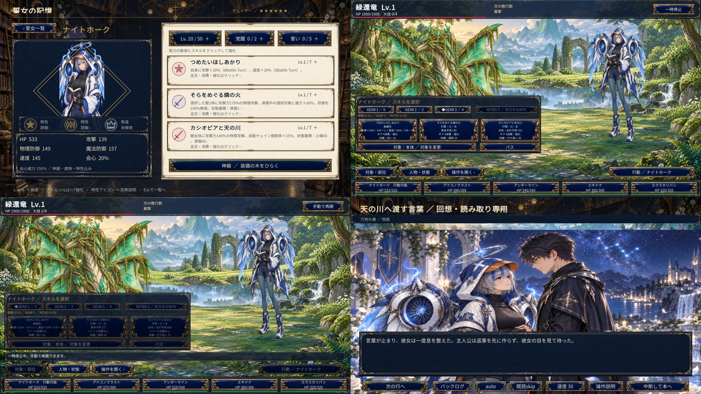

# newASTER

計画10の現行実装は11形態・10人・10ジョブ。R、アナイアレイター通常／聖夜、シェル、オリフラム、ナイトホークを追加し、人物ごとの戦闘・育成・神器・庭・物語へ接続しています。性格・口調・概要も保存。最新の開発ビルドは `game/Builds/plan10-nighthawk/newASTER.exe`、生成・検証手順は [ナイトホーク実装記録](docs/production/plan10-nighthawk-implementation.md)、全体の進捗は [計画10](docs/production/plan10-implementation-plan.md) を参照してください。Windows実行ファイルとローカル参考動画はGit管理の対象外です。



計画9の初期5人・5ジョブを実装したWindows正式配布候補です。15巨神獣、7世界、60章450詩、25交流、9庭10家具、人物固有神器、15遺物、ガチャ・交換・星の恵みを通常入口から利用できます。起動・タイトル・万物の書・戦闘・結果・ADV・育成・庭・設定を正式版用の美術へ統一しました。計画9 RC1の内容と検証履歴は[完了記録](docs/production/plan9-completion-status.md)に保存しています。

計画9の画像UI改修版は `0.9.5-rc.2`。全画面の共通パネル・ボタン・検索欄・スライダー・スクロールバーを画像UIに統一し、植物図書宮殿の背景も追加。[画像UI設計](docs/production/image-ui-design.md)、[制作プロンプト](docs/production/image-ui-prompts.json)、[画面確認](docs/production/image-ui-validation.json)。5枠の編成入替、巨神獣ごとの4段階素材と複数巨神獣の希少素材を使う神器を追加しました。ガチャは到着・開扉・降車の3枚のオリジナル一枚絵で演出します。戦闘のスキル選択はヒロインを隠さず表示し続け、リソースは任意消費で効果を強化。12属性、巨神獣の弱点・耐性、10種類の蓄積型状態異常も実装しました。ヒロインカード一覧、Lv1〜7のスキル・神器強化、枝別能力・最終特性も収録。[追加設計と画像制作](docs/production/combat-expansion-design.md)、[検証](docs/production/combat-expansion-validation.json)、[配布案内](docs/production/combat-expansion-readme.txt)。

神器のαは攻撃・会心、βは物理防御・魔法防御、γは速度・会心威力へ分化し、最終形に能力アップ特性を追加しました。ガチャ・交換・チケット・星の恵み・詩・オーパーツの装飾も改訂。[枝の設計](docs/production/heroine-branches-design.md)と[今回の検証](docs/production/heroine-branches-validation.json)を参照。

計画9配布版の起動は `dist/newASTER-0.9.5-rc.2-windows-x64/newASTER.exe`。当時の収録は初期5人で、追加制作は上記の計画10へ引き継いでいます。200人超の一覧管理は256件で機能検査し、今回の画面は720p/1080pの自動描画を確認しています。新UIの物理入力試験・聴取・追加性能測定は未実施です。

- [現行要求](docs/requirements/game.md)：最新の優先仕様。
- [実装計画と完了条件](docs/production/implementation-plan.md)：番号ごとの検証済み範囲と残作業。
- [計画8の詳細実装計画](docs/production/plan8-implementation-plan.md)：実装・通し機能・保存・最小実操作・修正後の聴取を完了。[完了ゲート](docs/production/plan8-completion-gate.md)に条件と証拠を固定。追加性能測定は行わず、従来の未実施項目は未実施のまま保持。
- [計画6の詳細実装計画](docs/production/plan6-implementation-plan.md)：万物の書・人物別装備の樹・2D箱庭・好感度・ADVを6-1〜6-10で接続。6-1〜6-10の機能ゲート完了。
- [計画6の完了記録](docs/production/plan6-completion-gate.md)：Core 5,540・Unity 1,174・Windows通し保存／再起動、箱庭・ADVの720p／1080p検証と後続制作範囲。
- [計画7の開発見本](docs/production/plan7-candidate-review.md)：人物1人・敵1体・背景・家具・CG・音を接続し、戦闘・箱庭は画像を大きく表示して必要時に操作を展開。2026-10-04の改訂条件で完了。
- [計画7の完了条件と検証](docs/production/plan7-completion-status.md)：表示・保存・再生結果・性能の条件を維持し、素材整合・編集元・検証記録の7検査群が合格。最終美術・聴感・量産工数は後続へ引き継ぐ。
- [初期正式5人・動画確認値](docs/data/initial-five-heroines.md)：動画の15技と、本作独自の資源・状態異常・固有行動を区別。
- [計画5の実装・検証記録](docs/production/plan5-completion-gate.md)：機能ゲート完了、初期fixture値、保存保全、Windows通し受入れと後続範囲。
- [計画3の受入れ記録](docs/production/plan3-completion-gate.md)：正式JSON、全15技・5固有行動、保存非破壊、検証と後続範囲。

- [ゲーム要求仕様 v0.2](docs/game-requirements-v2.md)：以前の統合仕様。現行要求と矛盾する場合は現行要求を優先。
- [旧・正式版の要件定義](docs/requirements.md)：旧方針の統合記録。現行仕様と矛盾する場合は上記を優先。
- [資料一覧・フォルダ構成](docs/README.md)：詳細仕様、人物調査、試作の検証、検討履歴。
- [継承ヒロインと物語の接続](docs/inherited-heroines.md)：指定7人、両作品終了後、同じ観測者であるプレイヤー。

過去の企画・試作資料に矛盾する場合は、上記の現行要求を最新版として扱います。以降の旧ブラウザ説明は旧試作の記録で、正式版の仕様ではありません。

ブラウザ試作では、仮の3人対ボス1体で、編成・遺物・発動／託す・誓い・翼破壊・報酬・強化・記憶解放を体験できます。初討伐で記憶を開き、強化3段階で試作クリア。その後も再挑戦できます。セラ・リネ・アシュと仮図形は技術検証用で、正式版の人物へ自動転用しません。

## Unity試遊版の起動

Unity Hubで [game/unity](game/unity) を開き、`Assets/Game/Scenes/Bootstrap.unity` を開いて再生ボタンを押します。Windows実行ファイルを作る場合は、Unityのメニューで `PlayableBuild > Validate And Build` を実行します。出力先は `game/Builds/playable/newASTER.exe` です。

試遊版では画面のボタンだけで全操作できます。キーボードではEscで一時停止またはメニューを閉じられます。

1. 表紙の「冒険をはじめる」を押す。
2. 「巨神獣」のしおりで翠還竜を開き、「5人の誓女と出撃する」を押す。
3. 本体または部位を選び、速度順で行動可能になった人物の技を選ぶ。詠唱技は予約後に発動し、自動チェインは追加コマンドなしで進みます。
4. 討伐後、報酬を使って「誓女・育成」でレベルを伸ばす。装備の樹は下記の機能検証セーブで試す。
5. 初回討伐後は「庭」「物語」で解放状態を確認する。本の「計画6の機能検証用セーブを開く」から、通常セーブとは別のファイルで家具クラフト・自由配置・5人配置・交流・検証ADV・回想を試す。正式本文は未制作表示を維持する。
6. 「キンダーガーデン」では初期配布と討伐で得る石を使い、★6誓女3%・均等確率の抽選を試せます。100回ごとに好きな誓女と交換できます。

「ページをめくる」は対象の変更、「ページを裏返す」は同一対象の情報面の変更です。しおりは大分類を切り替えます。

## 旧ブラウザ試作の起動

Windowsでは`start-game.cmd`をダブルクリックし、表示された`http://127.0.0.1:4173`をブラウザで開きます。プレイ中は起動したウィンドウを開いたままにしてください。終了はCtrl+Cです。

Node.js 20以上がある環境では、リポジトリ内で次のコマンドも使えます。追加パッケージのインストールは不要です。Windows起動スクリプトはこのPCのCodex同梱Node.jsも検出します。別のPCではNode.jsを別途用意してください。

```sh
node server.mjs
node --test tests/battle.test.mjs
```

HTMLの直接ダブルクリックではなく、ローカルサーバー経由で開いてください。サーバーは127.0.0.1だけで待ち受けます。4173番が使用中なら、既存の試作を閉じるか環境変数`PORT`で別の番号を指定できます。

`package-game.ps1`をPowerShellで実行すると、`dist/newASTER-prototype-0.2.0.zip`を作成します。ソース、起動スクリプト、テスト、説明資料を同梱。展開してから起動してください。Node.js本体とセーブデータは含まれません。

## 遊び方

1. 味方カードの矢印で順番を変え、左翼または本体を選んで出撃。
2. 指示待ちになったら「発動する」か「仲間へ託す」。選択中の時間制限はありません。
3. 託すと2戦闘秒後に次の仲間へ。最大3人で、予約した順に技を発動。
4. 翼破壊で次の大技を中断。本体HPを0にすると討伐成功。
5. 編成に戻り、星片4個で部隊強化。初勝利で記憶帳も開きます。

右上の「遊び方」で操作を確認できます。「指示をおまかせ」は毎回即発動し、誓いを温存するモードです。託すたびに誓いが蓄積し、2以上を残せば通常攻撃を強化。解放にチェックして発動すれば、その連携の攻撃・回復・防壁を強化します。

戦闘画面の下部に味方HP、指示欄に次の通常攻撃の相手と時刻を表示します。別のタブへ移動したときや記憶帳・遊び方を開いたときには一時停止し、「再開する」で戻ります。「撤退して編成へ」では確認後、素材を消費せず出撃前に戻れます。撤退確認を閉じたときも安全のため一時停止を維持します。

### 遺物

試作用に全種を最初から選べます。同じ遺物を複数人に装備することも可能です。

| 遺物 | 効果 |
| --- | --- |
| 共鳴の灯 | 技の後、同じ連携の以降の味方の攻撃技1回を30%強化。重複せず、連携終了で消失 |
| 薄明の護符 | 技の後、生存する全員に吸収30を6秒間付与。防壁の半減後に吸収。同種は加算せず更新 |
| 穿翼の欠片 | 本人の攻撃技の左翼ダメージを30%強化。通常攻撃・本体には無効 |

例えばリネに共鳴の灯を持たせ、アシュより先に連携すると攻撃技を強化できます。リネが最後なら共鳴を使えません。効果欄には、現在の順番・攻撃対象で効果がない場合も表示します。戦闘中の装備変更はできません。

保存はブラウザのlocalStorageです。星片、強化段階、記憶、勝利数、編成順、遺物を保存します。戦闘途中の状態は保存しません。ブラウザやポートを変えると別の保存領域になります。

## 実装と検証

- `src/engine.mjs`：描画に依存しない戦闘・育成ルール。
- `src/main.mjs`：画面、Canvas演出、保存。
- `tests/battle.test.mjs`：時間停止、連携順、戦闘不能、部位破壊、勝敗、報酬、保存など。
- [試作の検証記録](docs/prototype-validation.md)：実測結果と残る調整点。

この試作は操作を覚える入門難度で、最大連携が強めです。緊張感のある難度調整は次段階の課題です。3Dモデル、音声、ガチャ、複数ボスは今回の完成範囲に含めません。

## 開発・登録方針

```sh
node --test tests/battle.test.mjs
node tools/battle-parity.mjs
```

戦闘テストと、移植用の6ケース・110チェックポイントを確認できます。正式版の3D性能や交流機能の検証とは区別します。

原作クライアント・録画・抽出画像・プロフィール保存物、生成ZIP、ローカル設定はGit管理から除外します。保全台帳・録画一覧・保全用ツールも手元専用として除外します。正式版プロジェクトは将来 `game/` へ分離し、現在の試作を比較基準として残します。
