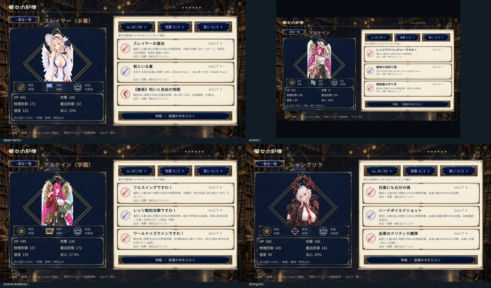

# newASTER

Windows・オフライン向け、Unityの2DイラストRPG。万物の書から巨神獣を召喚し、詩と素材を集めて世界を復元し、天使ヒロインの物語と交流を進める。

現行の計画10は **15形態・12人・全13ジョブ、15巨神獣・7世界、90章630詩・75交流**。スレイヤー水着、アルケイン、アルケイン学園、シャングリラまで追加済み。加入・戦闘・育成・神器・編成・庭・ADVを接続し、性格・口調・概要を人物資料へ保存している。

編成は「全体 → 隊員の設定 → 入れ替え候補」の3階層。各隊員の神器1枠と将来のオーパーツ1枠を分けて表示する。個別オーパーツの装備・能力適用・保存は後続実装。13ジョブの資源画像は形状を差別化し、画像比率と配置を65種類・76画面で確認した。



## 起動・ビルド

ローカルの最新実行ファイルは `game/Builds/plan10-shangrila/newASTER.exe`。実行ファイルと元動画はGitへ同梱しない。

Unity **6000.6.3f1**で `game/unity` を開き、`Assets/Game/Scenes/Bootstrap.unity` を再生する。WindowsビルドはEditorの `Plan10ShangrilaBuild.ValidateAndBuild` を実行する。通常入口は `Combat/battle-plan10-shangrila.json` と `Story/plan10-shangrila-story-content.json`。

万物の書の「誓女・育成」から「新しい天使を迎える」で計画10の追加形態へ無償加入できる。所持する異なる人物から5人を編成し、巨神獣のページから出撃する。衣装違いは好感度・恋人関係を共有し、育成・神器・読書進行は形態別に保持する。

## 開発・確認

```powershell
.	oolsalidate-plan10-expanded-roster.ps1
.	oolsalidate-plan10-ui-player.ps1
python tools/validate-plan10-doc-links.py
```

Core回帰検証8,546項目、Unity C#185ソース、Windowsビルドが合格。UI採取は隔離した保存データの自動シナリオで、物理マウス操作による試験とは区別する。最新ビルドの後にPlayer検証を実行し、同じ出力先のビルドと撮影を同時に行わない。

- [文書索引と定義元](docs/README.md)
- [計画10の実装とUI確認](docs/production/plan10-four-heroines-and-ui.md)
- [ヒロイン追加方法](docs/production/heroine-addition-guide.md)
- [計画10の台帳・進捗](docs/production/plan10-implementation-plan.md)
- [人物資料](docs/references/README.md)
- [文書整理の記録](docs/production/documentation-cleanup.md)

過去の計画・配布候補・旧試作は[履歴](docs/archive/README.md)から参照する。現在の起動手順や仕様の代用にはしない。
