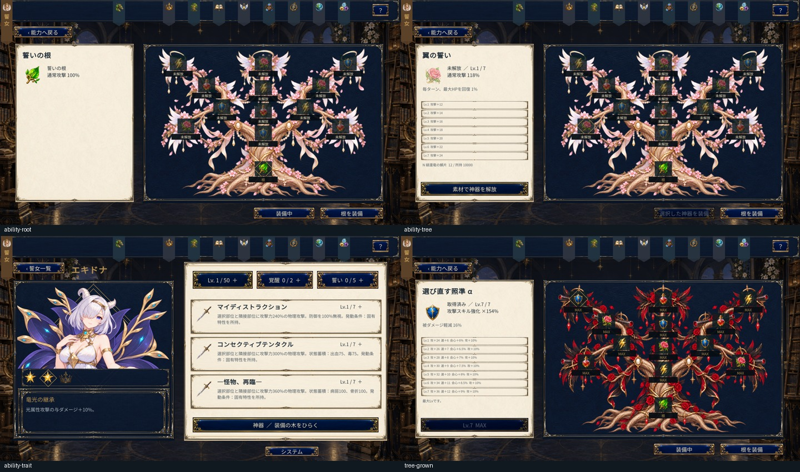

# 人物特性・神器ノード・戦闘開始の修正

## 特性

人物ごとに最大8枠を扱う。既存15形態は基礎特性・人物固有効果・熟達特性の3件を登録し、ジョブ共通の説明カードを廃止した。表示は登録件数に応じて並べ、9件以上や重複IDを拒否する。熟達効果もジョブからの推測ではなく、人物IDで定義する。

人物固有効果は `HeroinePersonalAbility` で表示と戦闘を共通管理する。HP条件付き与ダメージ、部位・本体へのダメージ、火・光・氷属性強化、再生、軽減、装甲中の軽減、リソース追加獲得を人物別に登録した。歌唱中のリソース獲得禁止、装甲への通常回復禁止、戦闘不能と出血の回復制約を維持する。

## 神器

根以外の各ノードには通常能力と1種類の固有能力を持たせる。固有能力は与ダメージ、最大HPに対する再生、攻撃ダメージ軽減、リソース追加獲得率のいずれか。ノードにはその能力に対応するアイコンを1つだけ表示する。装備したノードの固有能力が発動する。

再生は通常の戦闘ターン境界（100 Clock）で処理する。追加リソースは小数分を戦闘内で繰り越し、通常の少量獲得でも効果を得られる。ダメージ補正はオーパーツなどの同種補正と加算する。画像の新規生成はユーザー指定により後回しとし、既存アイコンを使用する。

根は初期解放・初期装備、固有能力なし、Lvなしとする。既存セーブでは未装備の人物へ根を補完し、すでに装備している枝・そのLv・既読を保持する。旧根のLv記録は除外し、根の強化操作を拒否する。「根を装備」で初期装備へ戻る。新規加入にも同じ初期化を適用する。

## 戦闘開始

旧戦闘表示の編成処理が初期5人の中だけで人物を検索しており、追加人物・衣装を含むと `-1` 番目の表示を参照していた。既存人物の表示を保持しつつ、追加人物には未使用の表示枠を割り当てる。編成に空枠がある場合は、出撃ボタンから編成画面へ移動できるようにする。

## 検証

自動回帰9,663項目。最大8特性、各ノードの固有能力、実ダメージ・回復・被ダメージ・少量リソース獲得、根の初期化と再移行を検証する。Windows Playerでは最大解像度1920×1080で画面を確認し、通常構成と旧戦闘表示を初期化した構成の両方で全15形態×5枠の戦闘開始を検証する。物理マウスでの実操作確認はユーザー指定により省略する。

Unity C# 227ソースのコンパイルとWindowsビルドが成功。最終Playerで7画面と戦闘開始150通りが合格した。追加で実行した旧Plan9難易度ゲートは今回の変更前（1e7b420）でも同じ検証条件で失敗するため、既存課題として区別する。

検証記録: [heroine-abilities-validation.json](heroine-abilities-validation.json)
