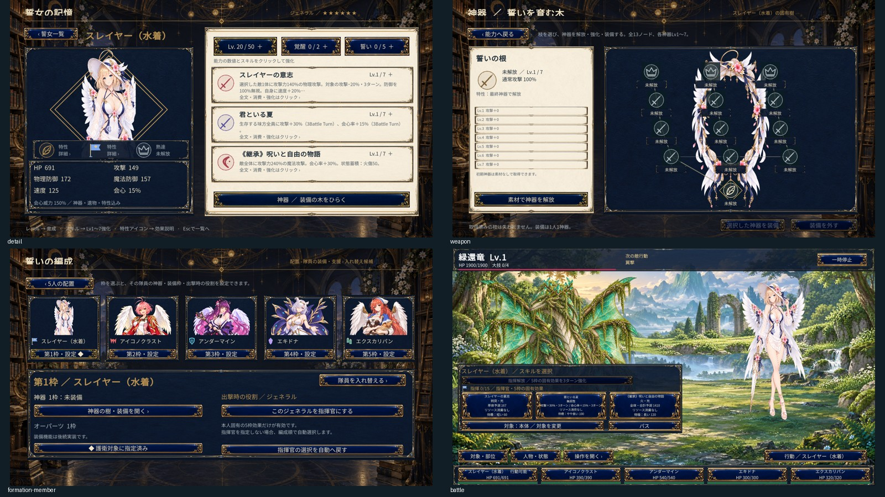

# 計画10：スレイヤー水着

2026-10-07。ジェネラルのスレイヤー水着を追加し、加入・育成・神器・編成・戦闘・庭・ADVへ接続した。

隊長を選び、5つの編成位置に応じた補正を適用する。本人の行動でリソースが増え、MAX15の強化は300Clock持続する。隊長の死亡、期限切れ、保存失敗と再試行を検証した。

人物の概要、性格、口調、動画の観察時刻、元の意匠と本作の創作は[人物資料](../references/characters/slayer-swim.md)に保存。天使の羽と光輪を含む専用美術18点を生成し、無加工で採用した。生成指示は `game/art-source/plan10/slayer-swim-generation.json`。原動画と参考切り出し画像はゲームやGitへ同梱しない。

3章30ページ・18詩・5イベント40段落を追加した。[スレイヤー水着の物語](../story-text/スレイヤー水着の物語.txt)に全文を保存。衣装違いは同一人物の関係を共有し、育成・神器・読書進行は別に保持する。

[美術検証](plan10-slayer-swim-art-validation.json)、[実行検証](plan10-slayer-swim-acceptance.json)に採用ハッシュと画面を記録する。全4形態を含む最終実行ファイルは `game/Builds/plan10-shangrila/newASTER.exe`。個別段階のビルドは `game/Builds/plan10-slayer-swim/newASTER.exe`。

共通の最終検証はCore8,546項目、Unity C#185ソースが合格。`tools/validate-plan10-expanded-roster.ps1`、`Plan10SlayerSwimBuild.ValidateAndBuild`、`tools/validate-plan10-slayer-swim-player.ps1`で再検証できる。画面採取は隔離した保存データを使う。

