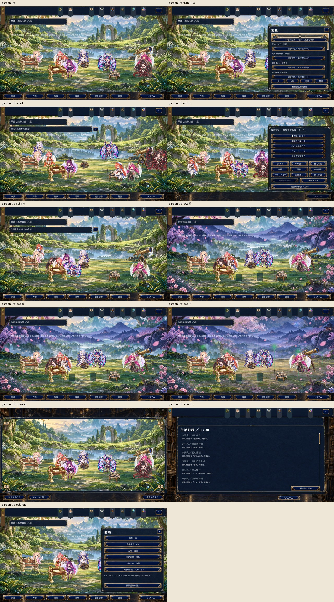

# Plan11-2 箱庭生活システム

ユーザー提供の仕様は [実装仕様 v0.1](plan11-2-garden-life-spec.md)。既存9庭・10家具・家具instanceId・住人配置を引き継ぐ。専用ブランチは `codex/plan11-2-garden-life`。画面検証はユーザー指定の最大サイズ1600×900に統一する。

## 保存と移行

`FormalCampaignSave.gardenLife` を追加。旧セーブにフィールドがなければ、最初の生活操作の保存候補へ設定を追加する。既存住人は同じ庭のFixedとして引き継ぐ。先行セーブの読み込みだけでは保存内容を置換しない。Unity JSONのnullと空文字の差は既存のデコード処理で正規化する。

保存するのは時刻・天候・自律生活設定、固定／優先／自動／非表示の人物割り当て、訪問回数、生活発見の環境記録、記念家具レシピ、解放済み催事・フレーム、庭ごと5枠の配置プリセット。現在位置、行動履歴、Social、催事、鑑賞時の停止状態は保存しない。

`GardenLifeJournal` は候補を凍結して一回の正式セーブへ保存し、成功時だけ公開する。失敗時は同一候補を再試行する。生活操作から世界発展、好感度、物語既読、戦闘育成、編成を変えることはできない。

## 庭の対応

|既存ID|機能タイプ|
|---|---|
|garden.grassland-forest|forest|
|garden.crystal-highland|highland|
|garden.flower-water|flower|
|garden.bamboo-waterfall|lakeside|
|garden.sakura-stargazing|stargazing|
|garden.oasis|city（既存のオアシス景観を維持）|
|garden.hot-spring|hotspring|
|garden.snowfield|snow|
|garden.integrated-world|central|

## 生活と編集

共有AIは表示中の庭の最大8人だけを更新し、同一人物の別形態を重複させない。庭ID・訪問回数・seedから行動を再現する。Idle／Move／Scenery／Furniture／Socialを選び、行動終了時に次を決める。家具と景観の利用枠は予約し、32×24の経路探索で家具footprintを避ける。行動履歴3件、同じ家具30秒・景観45秒・交流相手60秒の待ち時間は一時状態。

催事10種類は領域の最大到達Lvで解放を保持する。生活発見30件は家具利用・交流・環境・催事・Terraformのイベントで判定し、日常発見の抽選は20%、5回不発の次回は確定。10件だけが記念家具レシピを付与する。家具は素材を消費して即時作成し、1／5／10／MAXを選べる。

模様替えは作業コピーへ行い、Undo／Redoは50件まで。全収納は一操作。確定時に全配置を一括保存し、取消時は元の配置へ戻す。配置プリセットにinstanceIdは保存せず、適用時に在庫から割り当て、不足があれば数量を表示して中止する。

## 画像

記念家具は `UI/garden-memorial-furniture-v1.png` の10種類の原本画像を用いる。PNGの画素は変更せず、透明範囲に基づいて定義したUVと画像比率で描画する。制作には `image_gen.imagegen` の新規生成モードを使用。制作時のプロンプト、原本の保存先とSHA-256は [生成記録](../../game/art-source/garden-life-v1/generation.json) に記録する。環境音と効果音は [生成スクリプト](../../tools/generate-garden-life-audio.py) によるオリジナル音源12件で、[音源記録](../../game/art-source/garden-life-v1/audio-generation.json) を残す。

## 検証

`tools/Plan12GardenLifeTests.cs`：旧配置移行、保存失敗・再試行・再起動、保護された進行の不変性、全30発見条件と抽選上限、レシピ10件、即時バッチ作成、編集の取消とUndo上限、プリセット不足、seed再現、利用枠重複、Social、催事10種類、256人登録時の8人上限、Lv5／6／7の居住継続を検証する。

Windowsビルドは `Plan12Build.Build`、出力は `game/Builds/plan11-2/newASTER.exe`。全15形態を含むCore回帰9,248項目、Unity C#206ソース、Windowsビルドが合格。1600×900のPlayerで生活・家具・交流・編集・催事・Lv5／6／7・鑑賞・記録・設定の11画面を検証した。

物理マウスでは家具の移動、Undo／Redo、確定、会話と観察、ピクニックの開始と終了、時刻と天候変更、庭切替、システム保存を確認した。終了と再起動を挟み、移動した家具の座標、夜・固定の雨、最後に開いた雪原の庭を保持。システム保存ではrevisionが15から16へ進み、配置を維持した。

この環境で、8人表示のフォーカス中のPlayerを60秒計測した結果は森林55.53fps、雪原55.78fps。全11画面を60秒ずつ計測した値ではない。具体的な条件、ファイルハッシュ、検証結果は [受入れ記録](plan11-2-garden-life-acceptance.json) にまとめる。旧箱庭の10家具・5人の配置と再読込も別の隔離データで合格。一人暮らしと家具なしの庭も同じPlayerで表示を確認した。

