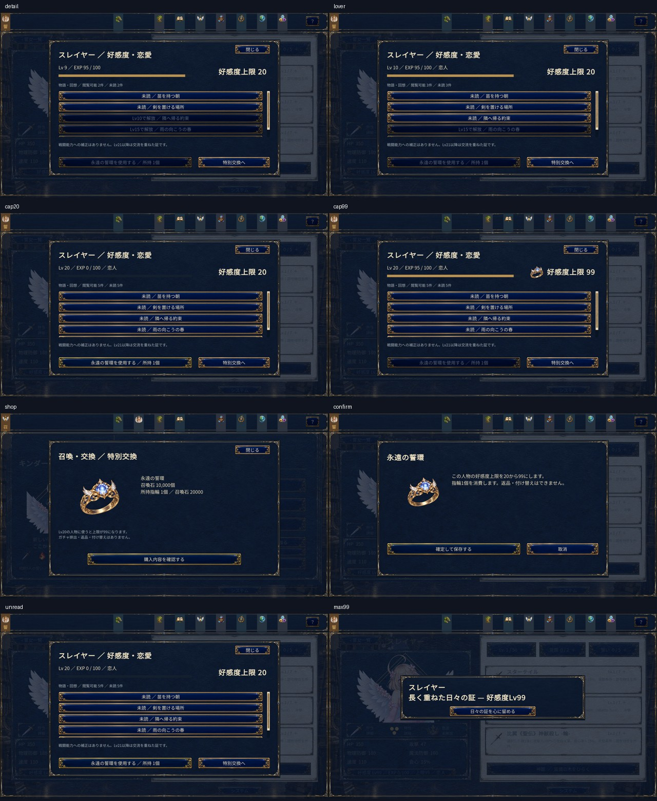

# Plan11-3 好感度・恋愛

[ユーザー指定仕様](plan11-3-affection-spec.md)を基準とする。ブランチは `codex/plan11-3-affection`。

## 既存形式と移行

現行の正式セーブは `home.affections` に形態IDと整数 `value` を保存し、イベントは1／5／10／15／20を閾値としていた。これは100EXP方式ではなく解放Lvとして使われていたため、旧整数をLvとして引き継ぎ、EXPは0にする。衣装間では最大値を採用し、既読を人物ごとにまとめる。既存の恋人状態がある場合は、Lv10以上に保つ。

旧値が20を超えていれば上限99として引き継ぎ、100以上はLv99へ収める。元の数値は `affection.legacyValues` と既存の `home` に保持する。旧 `loverHeroineIds` は互換履歴として保持するが、新しい恋人判定には使わず、新規の恋人フラグも追加しない。添字式の旧 `world.affections` から人物を推測して移行しない。

`FormalCampaignSave.affection` は追加フィールド。旧データのnullと新規データを区別する。人物ごとの `AffectionState`、連続交流内容、原子的操作の受領記録、Lv99演出の未確認／確認済み状態を保存する。人物の初期Lvは `HomeExperienceCatalog.initialAffections` で0〜20を指定できる。

## 交流と保存

会話は4秒、一緒に過ごす交流は8秒の完了で付与する。フォーカス喪失・操作説明・システム画面では進めず、取消では付与しない。会話の共通IDと、家具instanceId＋Interactionで連続内容を識別する。人物固有の会話本文は追加しない。

催事終了は参加人物を確定して報酬サービスへ送る。生活発見は参加者を記録し、発見・レシピ・3EXPを一つの保存候補で確定する。交流や観察をせず、自律行動だけを眺めていること自体にはEXPを付与しない。

戦闘は、既存の戦闘結果保存にEXP付与を追加する。勝利2、敗北1、撤退0。編成人物を重複排除し、再討伐は新しいbattleIdで再取得できる。同じbattleIdの再試行・再読込では重複取得しない。

指輪購入・使用・交流・Lv99演出確認は `AffectionRequest` と `CommitAffection` により候補を凍結し、保存成功時だけ公開する。指輪の所持数 `growth.eternalRings` は共通在庫。購入10,000石、使用条件Lv20／通常上限20。費用確認と取消は在庫を変更しない。

## イベントとUI

既存75イベントのID・本文・CGを維持し、解放条件をLvだけにする。登録数は固定5件から可変へ変更。回想はADVのReplayを利用し、既読・EXP・財布・進行を変更しない。

`HeroineEventDef` による人物ID、任意の形態ID、表示順、`visible / hint / hidden` を利用できる。既存イベントは形態ID付きで自動対応する。人物実装は `ProductionStoryContent.affectionEvents` に任意のメタデータを登録する。基本イベントはLv0〜20。Lv21以上の任意の回想を登録しても、上限突破や他イベントの解放条件に使わず、報酬を設定しない。

人物詳細の好感度ボタンと、庭の人物詳細「好感度・物語」から一覧を開く。恋人・未読・Lv10以上・Lv20以上で人物一覧を絞り込める。召喚ページの「特別交換」から指輪を購入する。上限99は指輪画像を併記し、現在LvとEXPは別に表示する。Lv99の到達通知は、確認を保存した後に再表示しない。

## 画像と起動

指輪はimagegenの組込み新規生成モードで作成し、原本を `game/art-source/affection-v1/eternal-vow-ring-v1.png`、ゲーム用の同一画素のPNGを `Resources/UI/eternal-vow-ring-v1.png` に保存した。[プロンプト・原本保存先・SHA-256](../../game/art-source/affection-v1/generation.json)を記録している。

Windowsビルドは `Plan13Build.Build`。実行ファイルは `game/Builds/plan11-3/newASTER.exe`。表示検証は1600×900のみとする。

## 検証

`tools/Plan13AffectionTests.cs` にAF-01〜AF-14、全段階のLv0→20→指輪購入・使用→99、生活発見の参加者EXPと保存失敗・再試行を追加した。既存回帰を含む9,300項目、Unity C#213ソース、Windowsビルドが合格。既読・旧好感度の移行、衣装共有、同一巨神獣の再討伐、交流逓減、256人物、回想の不変性、Lv99演出確認の保存再試行を検証した。

最新ビルドのネイティブPlayerで、好感度詳細・恋人・上限20・上限99・特別交換・指輪確認・未読・Lv99通知の8画面と、箱庭・戦闘結果の計10画面を1600×900で採取した。全画面の描画、指輪画像、文字配置を確認し、例外がないことと保存データが隔離されていることを検証した。採取は自動シナリオであり、物理マウス操作・手動再起動の検証はユーザーの指定により省略した。

[受入れ記録・ビルドと画面のSHA-256](plan11-3-affection-acceptance.json)



```powershell
.\tools\validate-plan10-expanded-roster.ps1
.\tools\validate-plan10-ui-player.ps1 -PlayerPath 'game/Builds/plan11-3/newASTER.exe' -Views @('affection-detail','affection-lover','affection-cap20','affection-cap99','affection-shop','affection-confirm','affection-unread','affection-max99','garden-life','battle-result')
python tools/validate-plan10-doc-links.py
```

UI採取用の起動では、フレーム数だけに依存せず描画後の経過時間で採取・終了する。通常プレイと手動操作用の起動には適用しない。
