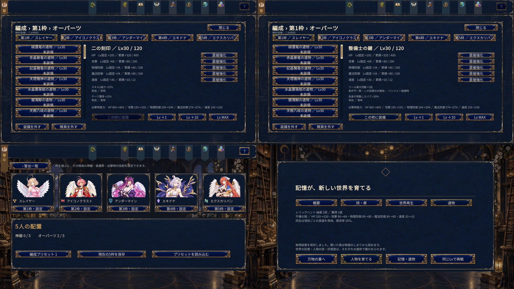

# Plan11-4 オーパーツ実装

実装基準は[ユーザー確定仕様 v1.0](plan11-4-ooparts-spec.md)。Plan11-3の人物・衣装共有好感度、箱庭生活、既読を維持し、オーパーツを編成枠装備へ移行する。

## 所持・装備・強化

42種類（既存15、職印13、特殊品5、戦術品9）を1種類1個で管理する。全ジョブへ装備でき、人物を入れ替えても装備は枠に残る。空枠でも保持し、空枠を含む編成は5人を置くまで出撃できない。同じ編成内の重複装備を拒否し、異なるプリセットは同じ所持品を参照できる。UIは3件の編成プリセットを提供し、保存構造の件数に固定上限は設けない。

2026-10-10の[Plan11-10第2回調整](plan11-10-arsenal-and-duplicate-balance.md)で、職印の全能力補正を30→20%、巨神獣由来15種の攻撃・HPを用途別に調整した。固定特性のマスタリーとは別であり、マスタリーの重複Rank連動・効果テーブルは変更していない。

HP・攻撃・物理防御・魔法防御・速度のLv固定値と累積ランダム値を別保存する。Lv1～120、+1/+10/MAXは既存の素材費用を使用する。素材不足の場合は購入できる段階まで上げ、確定前に実際の到達Lvと合計費用を表示する。

新規抽選は5項目を独立に20～100%で抽選し、同名再入手時は項目ごとの最大値を採用する。直接強化は80%以上の項目へ適用でき、約5%（速度+1）ずつ上げる。暫定費用はネクタル50,000と対応するLv15以上の巨神獣素材20個。抽選上限・Lv成長・費用・特殊効果はデータ定義から調整できる。

## 戦闘効果

特殊効果は最大2つ、AND/OR条件を効果ごとに判定する。ジョブ・スキル・行動・属性・HP・被弾・論理ターン・対象状態・編成条件へ対応する。条件不一致でも固定能力を失わず、該当する特殊効果だけを無効にする。所持するだけの全体補正は廃止した。

戦術品は火属性・部位、詠唱・WT、スタン付与、HP減少、被弾防御、初ターン、ツール回数、スキル2、支援役を用意する。ターン成長は論理100ごとに+10%、上限60%（2026-10-10の[Plan11-10数値調整](plan11-10-balance-adjustment.md)で旧+5%・上限20%から変更）。減衰型は60%から毎ターン10ポイント低下し、初期値へのバフ強化と減衰を分離する。

発動元のバフ強化を先に適用してから同種の割合を加算する。ジェネラルの有効指揮官・対象枠、アーティストの歌唱中スキル制限と全ゲージ獲得禁止、パンツァーのアーマーブレイク制約を保持する。ツール回数は戦闘開始時に増やし、アーマー復帰で回復しない。

持続時間の延長はパンツァーツールのみが行う。現時点で有効な延長可能バフと固定ターンのオーパーツ効果を対象に、期限だけを追加する。累計10ターンなどの旧上限はなく、期限切れ・後発・常時効果を除外し、減衰量と周期を維持する。旧スキル定義の味方持続延長は新しいオーパーツモードでは実行しない。敵状態異常の延長は従来通り扱う。

状態異常付与は固定値を加算し、その後に既存耐性を適用する。完全耐性も維持する。多段被弾は同一の攻撃アクションにつき1回まで数える。一時バフ・被弾情報は戦闘インスタンス内だけで保持し、通常セーブへ書き込まない。

## UI・保存互換

入口は「誓女 → 編成 → 隊員設定 → オーパーツ」。アイテムページからも詳細へ入れる。5枠、所持一覧と装備先、固定値・累積値・上限、独立条件と有効状態、出撃時の実能力の装備前後比較、Lv強化、直接強化を同じ画面に置く。戦闘でしか判定できない効果はその旨を表示する。同名取得の戦闘結果には5項目の更新前後を表示する。

旧所持・Lv・攻撃/HP累積値を引き継ぎ、旧人物装備は初回移行時の編成枠へ反映する。旧HPが新規上限400を超える場合は既存値を削らず、その品だけ旧上限1000を保持する。旧人物装備配列は互換情報として残し、以後の能力判定は編成枠を参照する。

装備・強化・編成プリセット・戦闘ドロップは、書込み成功後に状態を公開する。失敗時は現在値と費用を維持し、同じ操作の凍結候補だけを再試行できる。操作IDの再送では二重消費・二重抽選を行わない。戦闘中の装備変更を拒否し、戦闘側は開始時の装備コピーを保持する。

## 検証・起動

必須OP-01～OP-18の自動検証は `tools/Plan14OopartTests.cs`。回帰9,413項目とUnity C#221ソースのコンパイルが合格。全人物・衣装・物語・箱庭・好感度を含めた回帰試験は `tools/validate-plan10-expanded-roster.ps1` で実行する。

Windowsビルドは `Plan14Build.Build`、実行ファイルは `game/Builds/plan11-4/newASTER.exe`。Playerの表示確認は隔離セーブによる自動シナリオで720p・1080pを対象にする。物理マウスによる実操作確認はユーザー指定により省略する。

```powershell
.\tools\validate-plan10-expanded-roster.ps1
.\tools\validate-plan10-ui-player.ps1 -PlayerPath 'game/Builds/plan11-4/newASTER.exe' -Width 1280 -Height 720 -Views @('oopart-detail','oopart-conditions','oopart-turn','oopart-direct','oopart-level','oopart-pending','oopart-empty-slot','oopart-presets','oopart-items','oopart-battle','oopart-result')
.\tools\validate-plan10-ui-player.ps1 -PlayerPath 'game/Builds/plan11-4/newASTER.exe' -Width 1920 -Height 1080 -Views @('oopart-detail','oopart-conditions','oopart-turn','oopart-direct','oopart-level','oopart-pending','oopart-empty-slot','oopart-presets','oopart-items','oopart-battle','oopart-result')
```

最新版Playerの11画面を各解像度で採取し、計22画面の描画・例外・隔離保存を確認した。実際のレリックハント勝利による5能力更新比較を含む。



検証結果と画面ハッシュは [受入記録](plan11-4-ooparts-validation.json) を参照する。能力値・費用・入手率は最終バランス調整の対象。

## 編成UIの追加修正

編成を独立ページへ移動し、誓女カード直下にオーパーツ枠を配置した。入れ替えは誓女・オーパーツ共通の左詳細・右候補カード形式で、候補選択後の「決定」で保存する。操作説明は画面に応じた右上の「？」へ集約する。最新の検証・画面記録は[編成・入れ替え画面](formation-ui.md)を参照。
