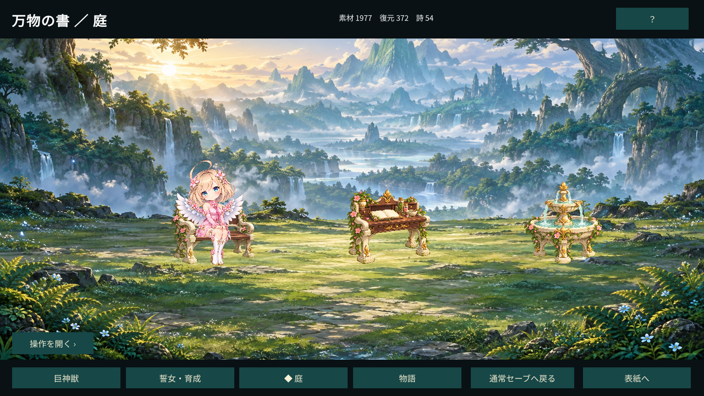

# 計画8：操作と表示の検査一覧

更新：2026-10-04。全体の受入れ状態は[完了ゲート](plan8-completion-gate.md)。下表の自動確認は、状態や取引を直接指定した診断とCore検査であり、実マウスで同じ経路を通ったという記録ではない。

| 操作 | 入り口と必要な情報 | 自動で確認した範囲 | 実操作・聴取 |
| --- | --- | --- | --- |
| 本の移動 | 下部のしおり、めくり、戻る | Book状態遷移、連打遮断、対象循環のCore回帰。独立画面診断は計画6の既存証拠 | not-run |
| 戦闘開始 | 巨神獣→解放済み召喚Lv→出撃確認 | 今回の毎戦の解放Lvチェック、実戦65戦と交換用追加周回 | not-run |
| 戦闘の技・部位・状態・TIME | 大きな敵／人物の上に、操作を開く→目的のパネル | 15技・部位効果・資源のCore回帰、通常速度の描画再生と結果一致 | not-run |
| 戦闘停止・取消・結果 | 停止／再開、撤退確認、結果タブ | 4再生方式の一致、勝利／敗北／撤退、保存失敗／再試行 | not-run |
| 育成・装備 | 誓女・育成→対象→Lv／覚醒／重複／装備→確認 | 5人のLv10／20／30、装備ノードと装備状態を物理保存。上限／不足と原子性はCore | not-run |
| 遺物 | 物語→オーパーツ→対象→強化／装備→確認 | Lv2と装備の再読込、80%整数境界・大量費用・同名max統合のCore回帰 | not-run |
| 抽選・提供率・交換 | キンダーガーデン→抽選／提供割合／交換／チケット→確認 | 同じbannerの200000抽選、実討伐石による100有償抽選・交換・確定使用、費用とreceipt再起動 | not-run |
| ログイン・時間報酬 | 星の恵み→受取確認 | 当日300石の実取引、60秒注入の専用保存失敗／再試行。30分・日付境界はCore専用時計 | not-run。実30分の到達未測定 |
| 庭の閉じた表示 | 庭のしおり。操作メニュー初期は閉じる | 専用試遊の720p／1080p画面、家具3件と利用中人物、実残高1977の表示 | not-run |
| 家具製作・配置・使用 | 操作を開く→家具／人物→対象→配置確認 | 実素材で製作・配置・利用・再起動。移動／撤去と占有はCore・既存home診断 | not-run |
| 章進捗・詩対応 | 物語→章進捗→条件・詩対応→戻る | 720p／1080p専用画面、54詩／8章、未制作章へ流用しない、長い条件はスクロール領域 | not-run。スクロールの実マウス確認未実施 |
| 交流イベント | 庭→必要時にイベント一覧→条件→交流→読書 | 不足拒否、素材1で解放、専用イベントだけの表示、人物絵未制作の明示 | not-run |
| ADV・長文・バックログ・CG | 章／イベント→読書。バックログ、閉じる、回想 | 全77行の保存、中断／未読再開、回想無変更。速度15／30／60／120・未読skip停止・CG復帰・多数行はCore／既存診断 | not-run。速度ごとの可読性未判定 |
| 設定・音・フォーカス | 設定→文字／音量／表示、停止から手動再開 | 日本語字形、6音源PCM、音の再生要求のrun記録。模擬フォーカスと停止契約は自動診断 | not-run。実AltTab、BGMループ・5効果の聴取未実施 |
| 保存待ち・取消・復旧 | 操作失敗時の同一内容再試行、原本を保持した復旧確認 | 毎戦・読了・家具・時計・交換の失敗無変更、二重確定拒否、未知版／別ID／破損backupの物理Core検査 | not-run。復旧確認をマウスで押したという証拠なし |

今回の専用画面は`validate-plan8-story-player.ps1 -Journey -Telemetry -Views progress,conditions,garden,events`で作り、resume／4表示では進行ファイルのSHA-256が新規完了時と一致する。720p／1080pは同じassemblyと素材hashを使用する。条件一覧の末尾はスクロール内で切れるが、戻るボタンの上へ文字を描かない。閉じた庭では大きな背景と人物・家具を表示し、操作一覧は常時展開しない。

画像は通しrun `story-f324e504f0f646378bb0c8359b8d8570`のgarden表示と同一ファイル。状態指定による診断であり、マウス操作の証拠ではない。

実マウス・実AltTab・聴取の受入れは未実施。現環境のUI工具はブラウザ面に限られ、Windowsネイティブプレイヤーの入力・人間の聴取を提供しない。模擬通知・画像確認・PCM検査で代用して合格にしない。負荷測定もこの表示確認から分離する。
